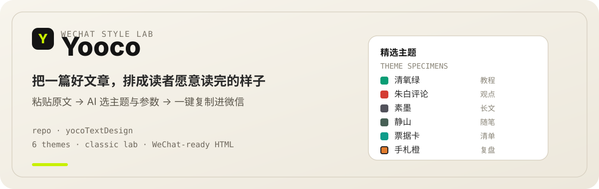
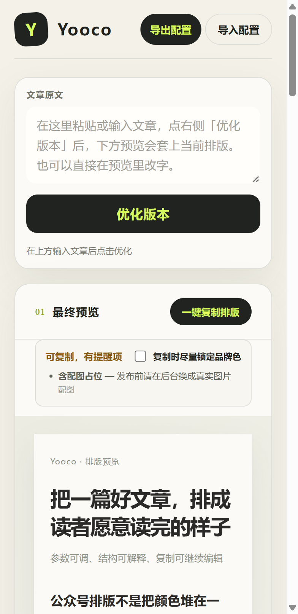
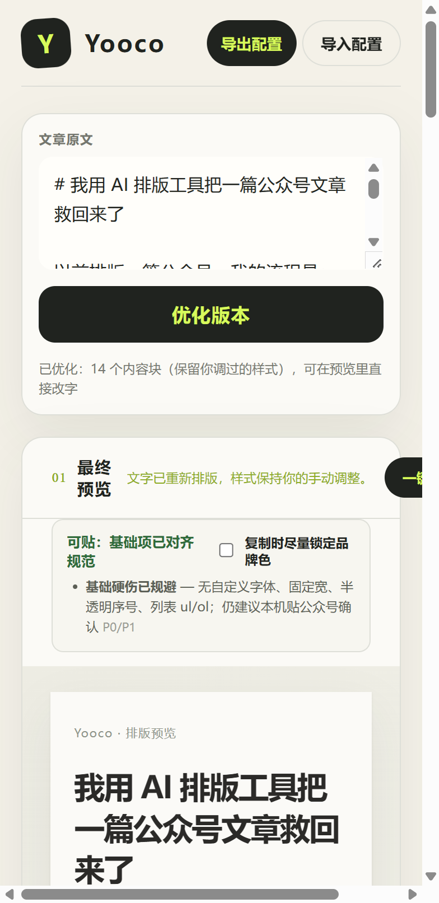
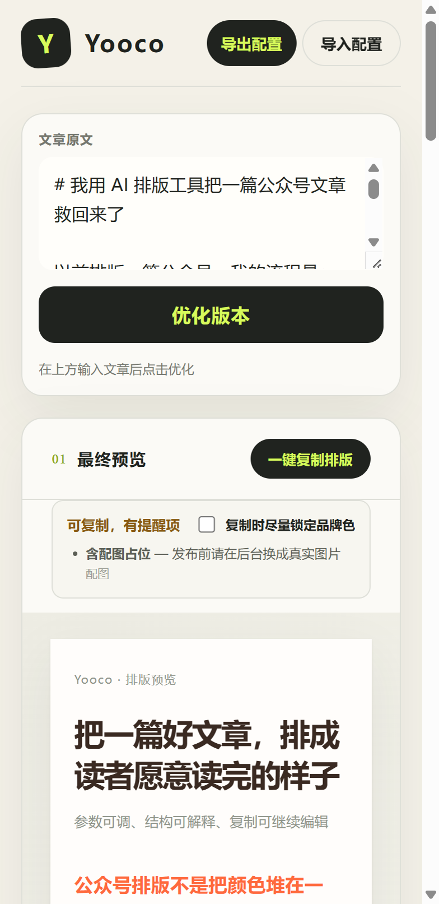
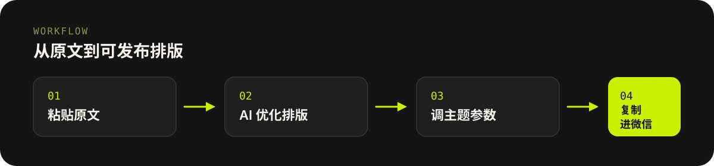

# Yooco · 公众号排版实验室

<p align="center">
  
</p>

**粘贴一篇文章，让它变成读者愿意读完、又能贴进微信后台的排版。**

仓库地址：[badboy0080/yocoTextDesign](https://github.com/badboy0080/yocoTextDesign)

---

## 它能做什么

| 能力 | 说明 |
| --- | --- |
| AI 优化排版 | 识别标题、段落、列表、引用等结构，并给出适合的主题与参数 |
| 六套精选主题 | 清氧绿、朱白评论、素墨、静山、票据卡、手札橙，另有「经典」可调气质与皮肤 |
| 预览即所见 | 在工作室里改字、改参数，预览同步更新 |
| 一键复制 | 生成尽量贴合微信编辑器的 HTML，带基础合规提醒 |
| 配置导入导出 | 把一套参数存成 JSON，换机器也能接着用 |

<p align="center">
  
</p>

<p align="center">
  
</p>

<p align="center">
  
</p>

---

## 使用流程

<p align="center">
  
</p>

1. 打开工作室页面  
2. 粘贴或输入文章原文  
3. 点击「优化排版」  
4. 需要时切换主题、微调参数  
5. 点击「一键复制排版」，粘贴到微信公众号编辑器

---

## 本地启动

**环境要求：** Node.js `>= 22.13.0`

```bash
npm install
```

配置 DeepSeek 密钥（「优化排版」需要）：

在项目根目录创建 `.dev.vars`（不要提交到 Git）：

```bash
DEEPSEEK_API_KEY=你的密钥
# 可选
DEEPSEEK_MODEL=deepseek-flash
```

启动开发服务：

```bash
npm run dev
```

浏览器打开：

```text
http://localhost:5173/studio.html
```

常用命令：

| 命令 | 作用 |
| --- | --- |
| `npm run dev` | 本地开发（默认端口 5173） |
| `npm run build` | 构建可部署产物 |
| `npm start` | 本地预览构建结果 |

---

## 精选主题一览

| 主题 | 适合内容 |
| --- | --- |
| 清氧绿 | 教程、测评、清单、工具盘点 |
| 朱白评论 | 深度分析、观点、力量感表达 |
| 素墨 | 极简长文、低调阅读 |
| 静山 | 生活随笔、人物、沉静叙事 |
| 票据卡 | 清单、复盘、结构化信息 |
| 手札橙 | 内刊手记、深度评测、案例复盘 |
| 经典 | 4 种气质 × 11 套皮肤，完全手动调参 |

AI 也可按文章类型（教程 / 盘点 / 观点 / 访谈 / 数据复盘 / 生活 / 案例）推荐主题；你随时可以手动覆盖。

---

## 和微信编辑器的关系

- 复制结果面向**微信公众号后台编辑器**粘贴使用  
- 会尽量避开自定义字体、固定宽高等常见贴坏问题，并给出提醒  
- 配图占位请在发布前换成真实图片  
- 最终仍建议在微信后台本地再预览一次

---

## 项目结构（上手相关）

```text
public/
  studio.html   # 工作室页面
  app.js        # 排版引擎与交互
  themes.js     # 精选主题注册表
  styles.css    # 界面与主题盖层样式
lib/
  deepseek-normalizer.js  # AI 结构化与主题建议
```

---

## 注意事项

- **密钥不要入库**：`.dev.vars` 已在 `.gitignore` 中，线上请用托管平台的 Secrets 配置 `DEEPSEEK_API_KEY`  
- 「优化排版」依赖外网可达的 DeepSeek；若部署在海外节点，可能出现超时，需要单独处理网络可达性  
- 本仓库由 vinext / Sites 脚手架承载前端与 Worker；产品入口是 `/studio.html`，不是默认首页模板文案

---

## License

以仓库内实际声明为准。使用第三方主题或样式灵感时，请自行确认合规要求。
